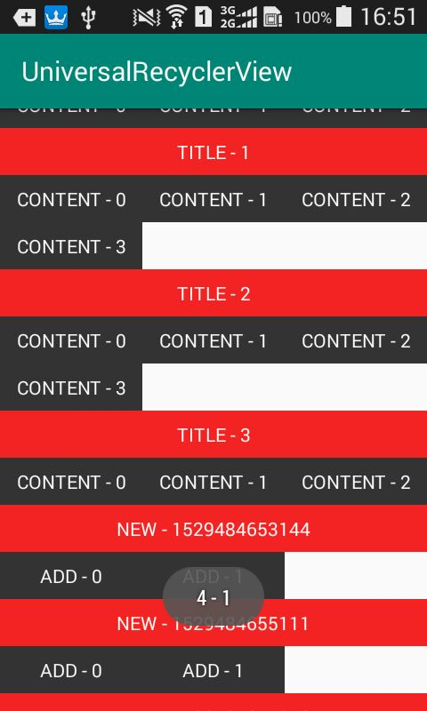
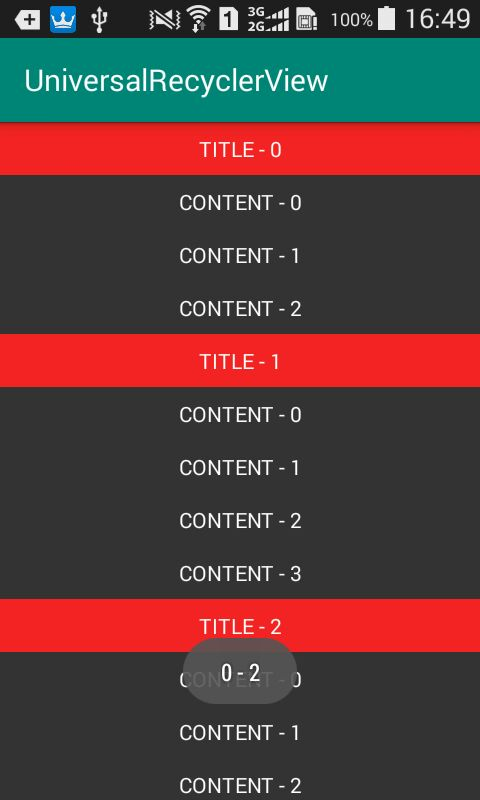
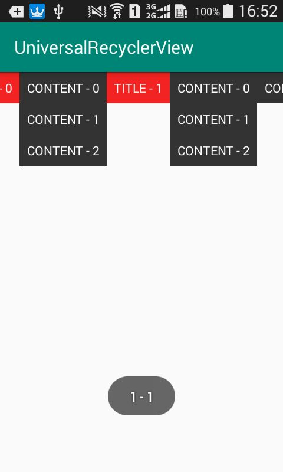

# UniversalAdapter
这是封装的带分类Recyclerview的Adapter，主要解决项目中分类列表繁琐的重复劳动。

* 不影响Recyclerview或其他封装的上拉下拉Recyclerview的正常使用
* 只需写一个继承UniversalAdapter的adapter
* 支持分类和子项部分的自定义布局
* 数据类需实现OnTypeList接口

#####  数据结构JSON示例

~~~~json
[
    {
        "title":"分类1",
        "child_list":[
            {
                "content":"子项1"
            }
        ]
    },
    {
        "title":"分类2",
        "child_list":[
            {
                "content":"子项2"
            }
        ]
    }
]
~~~~

##### 效果图

* 竖向多列

* 竖向单列

* 横向多列

#### 基本思路 

参照以上数据结构示例，数组嵌套数组，每个分类对应一个标题和一个List。拿到数据源后需要区分出哪个字段是标题，哪个字段是子项的列表，以便后续的计算和分类。

getItemCount返回每一个分类和标题数量的总和，即将标题和子项当做一个同一级（没有嵌套）的列表，标题栏独占一个position。但数据源仍然是一个嵌套的列表，最终在onBindViewHolder回调的时候会计算并分别回调外层、内层的position。

考虑到ItemDecoration很难支持多列并且只能通过加高child去画出简单的标题栏，所以标题栏是根据不同的viewType去画不同layout的ViewHolder，并通过layoutManager.spanSizeLookup设置为spanCount，以此实现支持多列。

> 主要难点在于根据onBindViewHolder中的position去计算判断是子项还是标题项。

#### 关键代码

* 数据类要实现的接口

~~~~kotlin
interface OnTypeList<T> {
    fun getTitle(): String
    fun getBody(): MutableList<T>
}
~~~~

* 数据类示例

~~~~kotlin
data class ParentListItem(val childList: MutableList<ChildListItem>,
                          val titleStr: String = "") : OnTypeList<ChildListItem> {
    override fun getBody() = childList

    override fun getTitle() = titleStr
}
~~~~

> 数据类需要实现OnTypeList接口，以便UniversalAdapter知道childList和title对应的字段。这里直接返回相应字段即可。

* 在UniversalAdapter一初始化便要对标题position记录，这里用hashMap去记录标题的index

~~~~kotlin
private var titleIndexMap = hashMapOf<String, Int>()

init {
   init()
}

private fun init() {
        data.forEachIndexed { index, item ->
            var pos = 0
            repeat(index) {
                pos += data[it].getBody().size
            }
            pos += index
            titleIndexMap[item.getTitle()] = pos
        }
}
~~~~

> 通过数据类实现的接口去获取childList和title。利用两层循环把数组每一项的标题和对应的子项数量相加，得到每一个标题的position

* 计算position的外层和内层index

~~~~kotlin
override fun onBindViewHolder(holder: ViewHolder, position: Int) {
        var parentIndex = 0
        var childIndex = position + 1
        for (item in data) {
            if (childIndex > (item.getBody().size + 1)) {
                childIndex -= (item.getBody().size + 1)
                parentIndex++
            } else {
                break
            }
        }
        childIndex -= 2
        if (childIndex == -1) {
            onTitleBindItemView(holder, parentIndex)
        } else {
            onBodyBindItemView(holder, parentIndex, childIndex)
        }
}
~~~~

> 根据当前position，从数组开头逐个减去childList.size+1(标题)，大于0则parentIndex+1，小于或等于0则说明正处于数组的当前index中，以此得到外层index，即parentIndex。减的刚好大于0时的position减去1(标题)就是内层子项的index，即childIndex。

* 追加数据后需要调用此方法，以便重新计算标题位置

~~~~kotlin
mAdapter.refresh()
~~~~

* 支持多列

~~~~kotlin
//横向
//layoutManager.orientation = GridLayoutManager.HORIZONTAL
layoutManager.spanSizeLookup = object : GridLayoutManager.SpanSizeLookup() {
      override fun getSpanSize(position: Int): Int {
            return if (mAdapter.isTitle(position)) layoutManager.spanCount else 1
      }
 }
~~~~

> 标题需要占满，所以此代码是必需的。可根据需求自行在Activity中定制LayoutManager，也可直接使用sample中的UniversalRecyclerview。

项目地址：https://github.com/Loren1994/UniversalTypeRecyclerView

##### 如果对你有帮助，请给个star~ 欢迎issue~